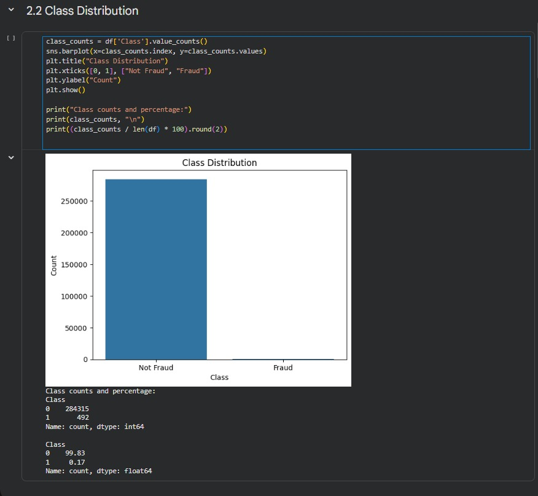
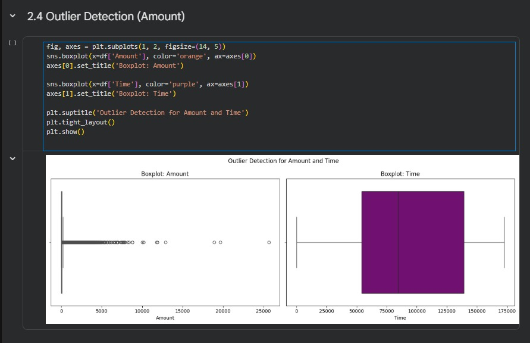
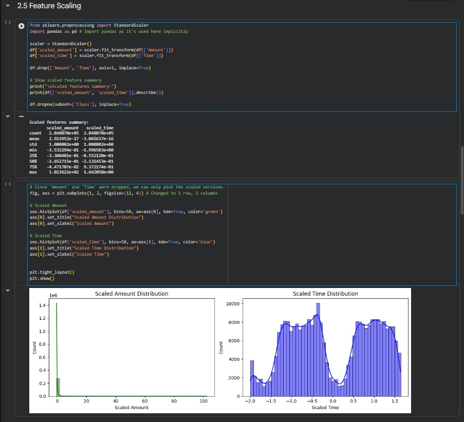
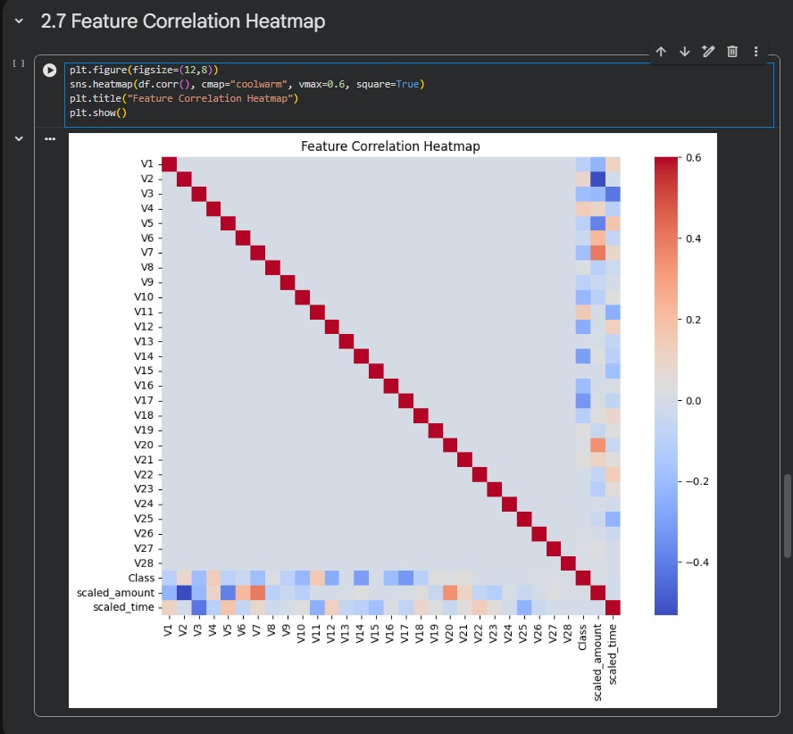
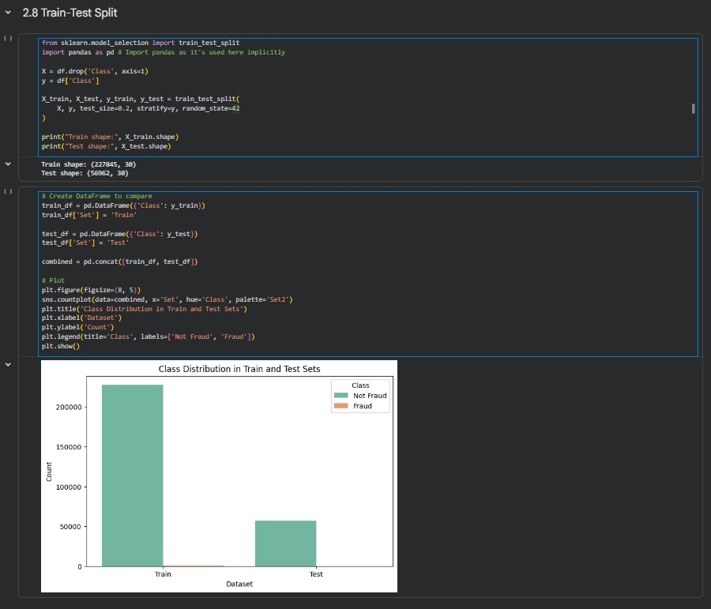

# Credit Card Fraud Detection - EDA & Preprocessing

## Overview

This project performs Exploratory Data Analysis (EDA) and data preprocessing on a real-world credit card fraud detection dataset containing 284,807 transactions.

The objective is to understand the dataset characteristics, identify class imbalance, detect outliers, perform feature scaling, and prepare the data for machine learning model development.

## Dataset Information

- Source: Kaggle Credit Card Fraud Detection Dataset
- Transactions: 284,807
- Fraud Cases: 492
- Features: 30
- Target Variable:
  - 0 = Not Fraud
  - 1 = Fraud

## Project Workflow

1. Dataset Overview
2. Class Distribution Analysis
3. Missing Value Analysis
4. Outlier Detection
5. Feature Scaling
6. Feature Distribution Analysis
7. Correlation Analysis
8. Train-Test Split
9. Data Preparation for Machine Learning

## Sample Analysis Results

### Class Distribution Analysis

### Outlier Detection Analysis

### Feature Scaling Analysis

### Correlation Heatmap Analysis

### Train-Test Split Analysis

## Technologies Used

- Python
- Pandas
- NumPy
- Matplotlib
- Seaborn
- Scikit-Learn
- Google Colab

## Skills Demonstrated

- Exploratory Data Analysis (EDA)
- Data Preprocessing
- Feature Engineering
- Data Visualization
- Statistical Analysis
- Machine Learning Preparation

## Author

Mohammad Farihin Roslan
Bachelor of Computer Science (Intelligent Machine)
Universiti Kebangsaan Malaysia (UKM)
